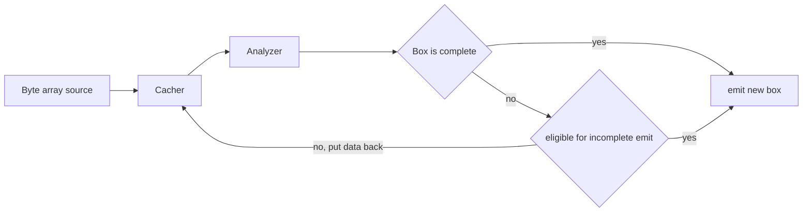

# MP4 crawler library and application

The goal of the project is parse MP4 files and extract internal data. MP4 files are comprised of "boxes" so it's where the project name comes from.

This is basically a test task for an employer, not a real project. If you are reading this text then most likely you're one of dev team members dedicated to review new candidates and me particularly.

The project is written with help of Qt framework. Qt has everything necessary for such kind of task and to visualize what's going on and also has perfect documentation. That will fit well the requirements and ensure fast development.

There are 3 sub-projects inside:

- src - crawler library
- tools - demo application and visualization tool
- test - unit tests for the library

## Building

First ensure you have next packages installed

- qt core dev
- qt gui dev
- qt widgets dev
- cmake

Next use cmake as easy as following assuming you are in the projects directory:

```bash
mkdir -p build && cd build && cmake .. && cmake --build .
```

## Starting up

One can you the built by default application in the `./tools` directory.

## Design

So we have boxes and one of is root box. A box can emit other boxes or byte arrays depending on its type. There is also a controlling object, an entry point for all the operations. Except providing boxes the controlling object will also report any transport issues.

The pipeline looks like..



From a library user perspective everything looks like following

1. Create Unboxer object of some specific flavor
2. Attach signals for getting new boxes
3. Start getting all kinds of boxes starting from the root one
4. A box will have `incomplete` flag on and it automatically start behaving as a streaming container. In other words as soon as you set data callback on the new box it will start catching new data/boxes.
